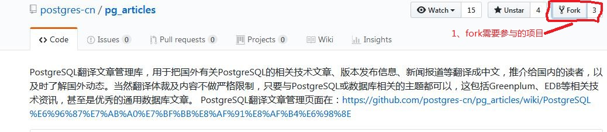
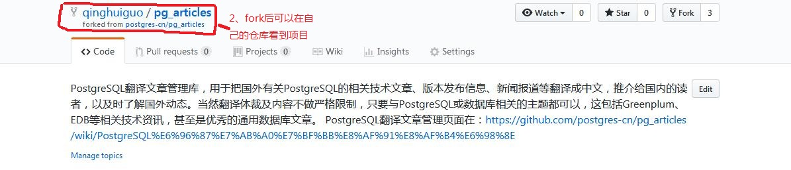
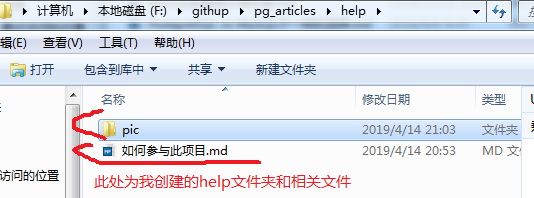
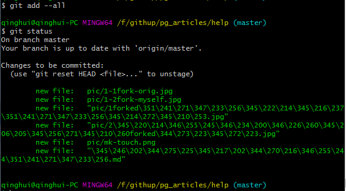
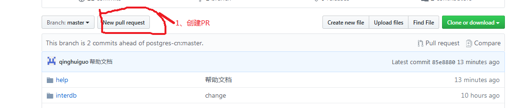
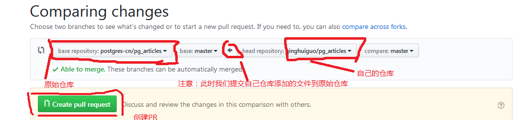
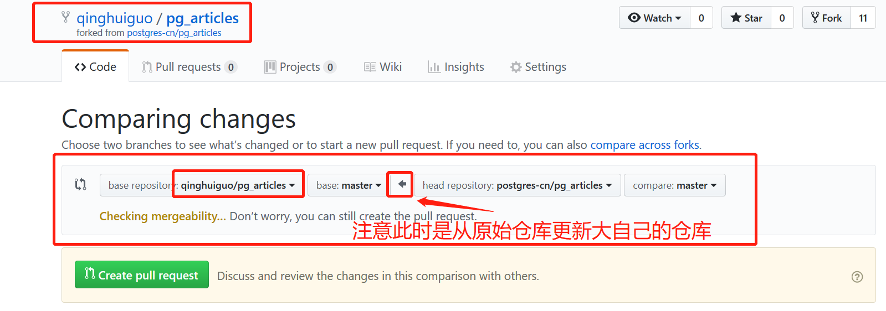
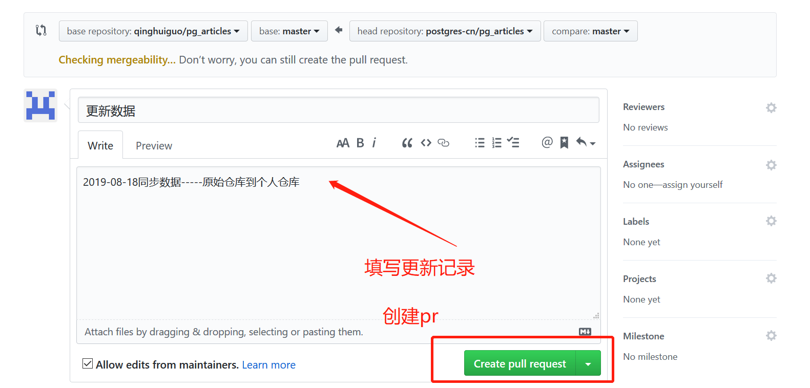
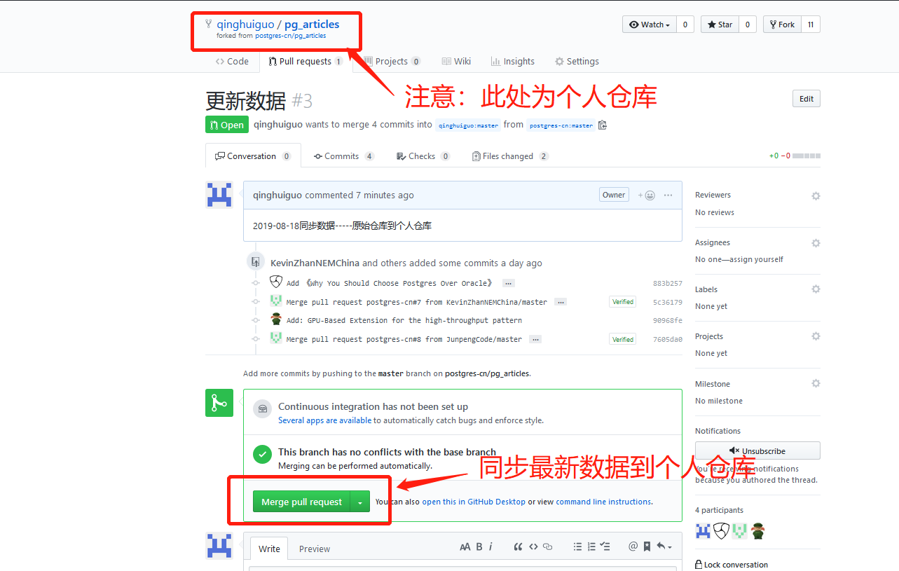

#  如何参与到该项目的

### 作者

qinghui.guo

### 日期

20190414

### 标签

提交PR,fork，同步最新版本仓库。

## 一、注册github账号

>如果您有githup账号可以跳过。

## 二、fork原始仓库

2-1 fork需要参与的项目，如下图

2-2 fork后可以在自己的仓库中看到该项目。

> 注意此时fork后的项目所属已经改变，我们后期所有的参与工作都是在自己的pg_article中操作，然后把自己修改的东西提交到自己的pg_article中，最后提交到原始pg_article（通过提交PR实现）。

2-3 克隆fork 的项目到本地。

git clone https://github.com/qinghuiguo/pg_articles.git

> 注意此处是本人fork 的项目，为了保证安全，我们没有原始项目的操作权限，只能通过PR的方式提交自己的翻译的文章。

2-4 本地在相关目录下创建相关的目录和文件。

> 例如我创建了help目录，子目录和相关文件，此时可以写文档啦，好开心。

## 三、如何添加文件到自己的仓库

> 我写的文档那么完美，那么流畅，该如何添加文件到我的仓库里呢？

3-1 添加文件

git add --all

>将所有文件都添加到仓库中，如果想添加某一个文件，则将后面的--all换成你要提交的文件名即可。

3-2 检查一下添加的文件

git status

如下图，添加成功

3-3 cmmit 到仓库中

git commit -m "注释语句"

> git commit -m "帮助文档"

3-4 提交到远端仓库
git push

如下图：

> 此时还没完，还要将commit的代码push到远程分支，由于我们本地只有master分支，所以我们可以直接执行命令。此处需要输入用户名和密码。

>好了，此时我们已经把我们更改的东西提交到了我们自己远端仓库，好开心，万里长征第一步，我们的文档已经飞翔在云端。

## 四、如何把自己添加的文件提交到原始项目中

> 翻译的文章这么完美，流畅，是时候提交到原始仓库，分享给大家了。
> 此时该如何提交PR?

4-1 创建PR 

4-2 PR 详情

4-3 merge 到原始仓库中

> 完美，成功提交，我完美的翻译大家都可以看到了，哈哈哈。
> 稍等，此处提交PR后，还需要仓库管理同意才能merge。

4-4 等待中，后续会继续更新。

## 五、如何从原始项目更新到个人仓库

5-1 个人仓库创建PR

小伙伴都好棒啊，提交了很多个人翻译，那该如何从原始仓库同步数据到个人仓库呢？

> 小伙伴们都棒棒哒!需要注意一下，需要经常从原始仓库更新最新数据哦，否则个人想向原始仓库提交merge请求会失败。这很可能是个人仓库和原始仓库差别太大了，githup版本控制有硬性要求哦。小伙伴们加油，赶快更新自己的仓库，有惊喜哦!!

5-2 填写此次PR的详情。

一定要认真填写哦，这样才知道自己做了什么。

5-3 merge 最新的数据到个人仓库
哈哈哈，成功更新了各位小伙伴提交的新内容，感觉自己棒棒哒！

>注意哦，是merge到个人仓库，这个自己就能同意。如果是PR请求merge 到原始仓库，需要原始仓库作者的同意哦。一定要注意，此时更新会覆盖个人仓库的相同文件，小伙伴们不要吧自己辛苦修改的文件给覆盖掉了！！！

## 六、如何从个人仓库更新数据到个人本地仓库。

6-1 git pull：相当于是从远程获取最新版本并merge到本地
  
git pull origin master

> 这个很简单啦，但是要注意哦，***此时更新会覆盖个人本地仓库的相同文件***，小伙伴们不要吧自己辛苦修改的文件给覆盖掉了！！！

6-2 更安全的从个人仓库更新数据到本地个人仓库。

git fetch：相当于是从远程获取最新版本到本地，不会自动merge
    
git fetch origin master
git log -p master..origin/master
git merge origin/master

>以上命令的含义：
   首先从远程的origin的master主分支下载最新的版本到origin/master分支上
   然后比较本地的master分支和origin/master分支的差别
   最后进行合并
   上述过程其实可以用以下更清晰的方式来进行：
  
git fetch origin master:tmp
git diff tmp
git merge tmp

    
> 从远程获取最新的版本到本地的test分支上，之后再进行比较合并

